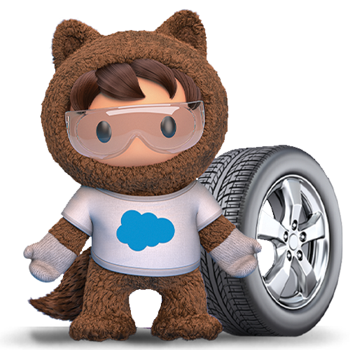
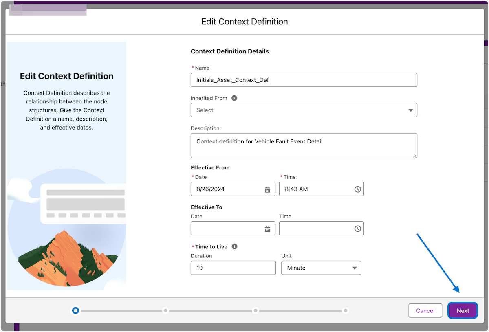
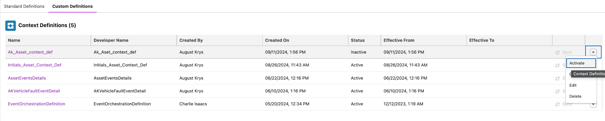
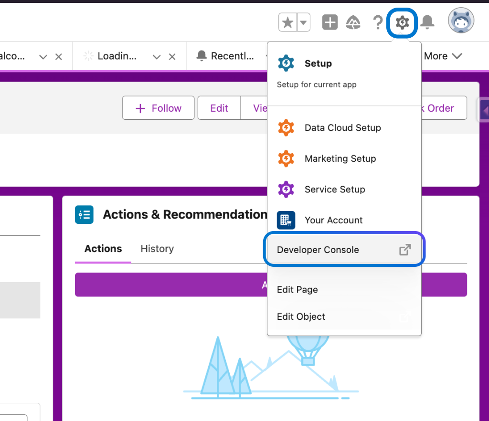
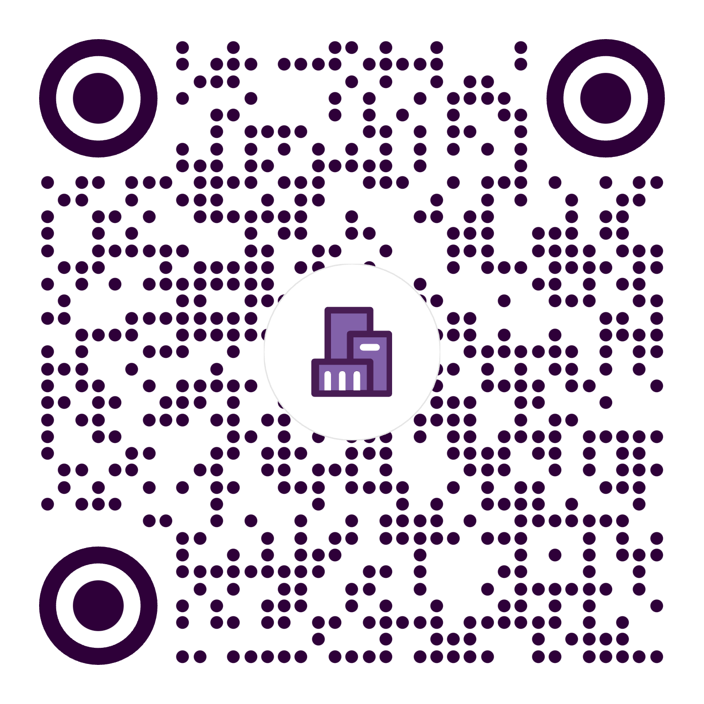
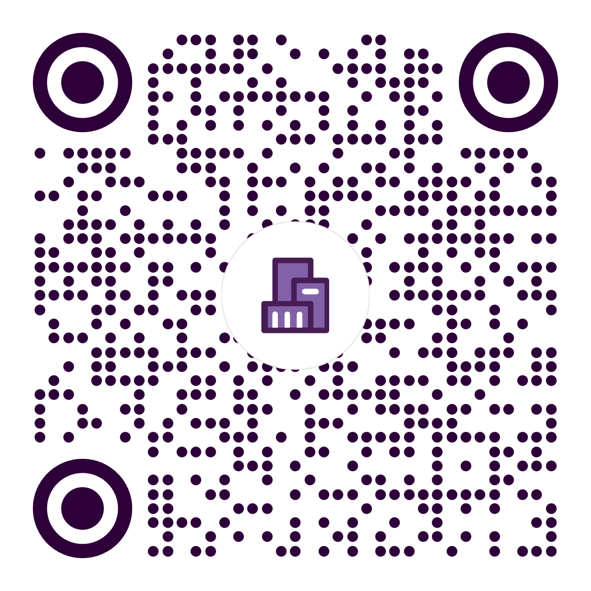
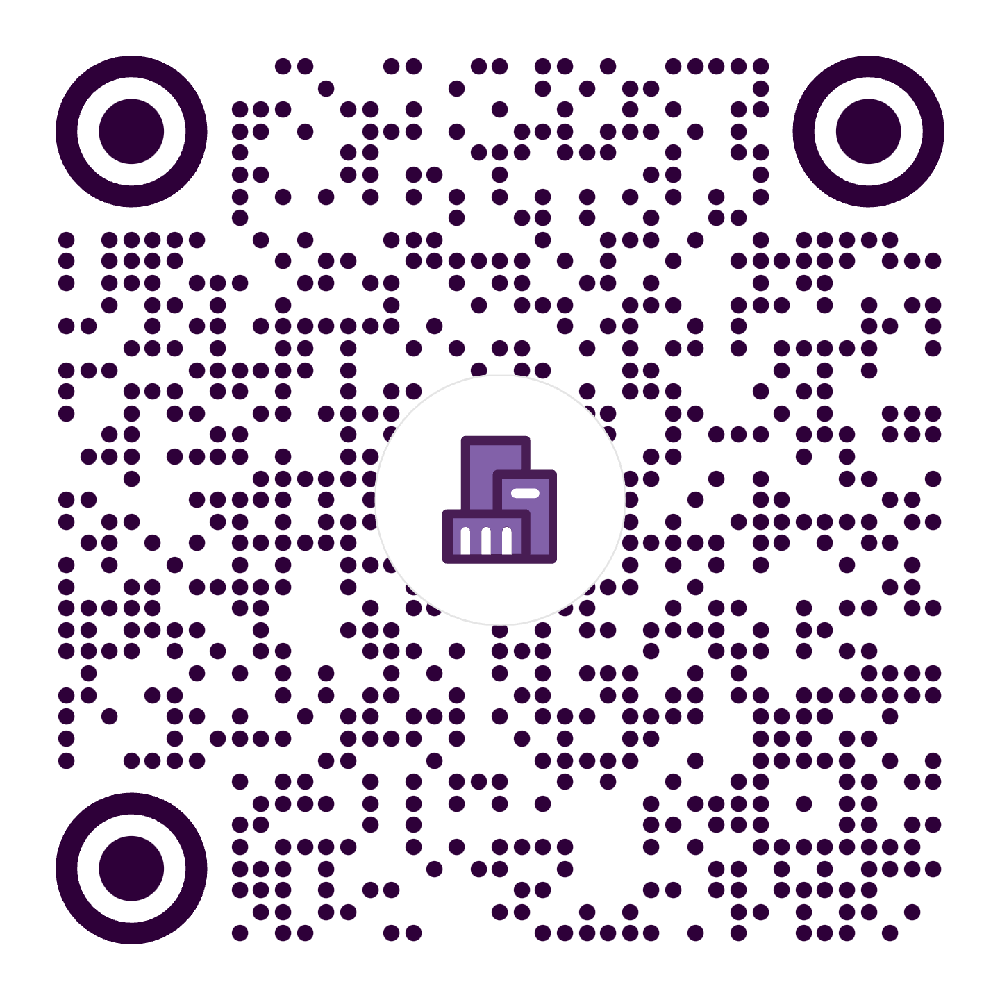

# 

# {width="2.088542213473316in" height="0.542836832895888in"}{width="0.7864588801399826in" height="0.6458333333333334in"}Get hands on with Connected Assets and Vehicles

# 

# 

{width="4.399512248468941in"
height="4.703125546806649in"}

{width="5.519524278215223in"
height="4.469095581802275in"}

{width="3.5822397200349956in"
height="3.5822397200349956in"}

Attendee Guide

# **Connected Asset or Vehicle Configuration Guide**

**Index**

# 

[**Get hands on with Connected Assets and Asset Centric Service
1**](#get-hands-on-with-connected-assets-and-vehicles)

[**Connected Asset or Vehicle Configuration Guide
2**](#connected-asset-or-vehicle-configuration-guide)

> [🪧 Context Service Configuration Guide 2](#_773iiihpkrsw)
>
> [👬 Cloning an existing definition 3](#cloning-an-existing-definition)
>
> [🛠️ Context Service Customization 5](#context-service-customization)
>
> [🧩 Context Definition Attributes 8](#context-definition-attributes)
>
> [🫸 Context Definition Tagging 10](#context-definition-tagging)
>
> [🗺️ Context Definition Mapping 11](#context-definition-mapping)
>
> [😃 Asset Context Definition Completed
> 17](#asset-context-definition-completed)
>
> [⚙️ Actionable Event Management 17](#actionable-event-management)
>
> [🦾 Execution Procedures and Expression Sets
> 20](#execution-procedures-and-expression-sets)
>
> [🥅 Testing with Developer Console
> 30](#testing-with-developer-console)
>
> [🛌 Developer Console 31](#developer-console)

[**Want to learn more? 34**](#want-to-learn-more)

# 

**​🪧 Context Service Configuration Guide**

Guided steps to create and extend a context service definition for
connected vehicles or Assets

## **👬 Cloning an existing definition**

Get off to a fast start by cloning an Out of the Box context definition.

### **1. 1. Type \"Context service \" in setup search 2.Click on \"Context Definitions\"**

{width="8.0in"
height="4.847222222222222in"}

### 

### 

### 

### 

### **2. 1. In the Standard Definitions tab -\> VehicleFaultEventDetail, Click the Carrot icon**

{width="7.546875546806649in"
height="4.569397419072616in"}

### **3. Click on Clone**

{width="5.786458880139983in"
height="3.503519247594051in"}

### 

### **4. 1. Paste \"Initials_Asset_Context_Def\" into input 2. Click on Save**

{width="6.869792213473316in"
height="4.1594444444444445in"}

## **🛠️ Context Service Customization**

Configure the new context definition for Assets

### **5. 1. Click on Custom Definitions 2. Click on the Carrot icon 3. Click Edit**

**Here we will start editing the cloned Context Definition to align to
connected asset event stream**

{width="8.0in"
height="2.5833333333333335in"}

## 

**🫚 Context Definition Nodes\
\**
Nodes are canonical objects containing attributes mapped to real data by
the consuming application. A structure is defined between nodes to
ensure that the right set of information is passed during each step of
the process.

### **6. 1. Click on Next**

**Time to start modifying attributes and adding new nodes**

{width="8.0in"
height="5.430555555555555in"}

### 

### 

### 

### 

### **7. 1. Click on Add Child Node**

Creating a new child node under the signals node

{width="6.369792213473316in"
height="4.354349300087489in"}

### **8. 1. In the new child node Type \"thresholds\" 2. Click Next**

Naming a new child node within signals node and completing the main
structure

{width="7.406490594925634in"
height="3.619792213473316in"}

## **🧩 Context Definition Attributes**

Attributes are fields on a node that can be mapped to sObjects or any
input data source**.**

### **9. 1. In the Attribute section find \"vehicleName\" and replace with \"assetName\" 2. Repeat for \"vehicleId\" and replace with \"assetId\"**

Renaming attributes to align with asset instead of vehicle

{width="7.307292213473316in"
height="4.424337270341208in"}

### **10. 1. Click on thresholds node 2.Click on Add Attributes**

Lets start adding attributes to the new signals child node -\>
thresholds

{width="6.8125in"
height="2.4218755468066493in"}

### **11. 1. In the new Attribute , Attribute Name type \"lower\" 2. In the Attribute Type field select \"INPUT OUTPUT\" 3. In the Attribute Data Type field select \"Number\" 4. Repeat Steps to create the \"upper\" threshold attribute 5. Click Next**

Adding new upper and lower attributes to the thresholds node

{width="8.0in"
height="5.347222222222222in"}

## 

## 

## 

## 

## 

## 

## **🫸 Context Definition Tagging**

Tags are used to define the context structure and point to a node or
attribute so the consuming application can query data directly from the
context definition.

### **12. 1. Click on Events node 2. Add a tag to assetId by Typing \"assetId\" and select done 3. Repeat for assetName tag by Typing \"assetName\" and select done**

**Lets tag the Event attributes so applications can query the data from
the definition**

{width="6.880208880139983in"
height="4.12812554680665in"}

### **13. 1. Click on the blank space ,if missing delete icon, next to the vehicleId tag to remove it. 2. Repeat for vehicleName**

Time to remove the old vehicle tags for cleanup

{width="6.75in"
height="2.0625in"}

### **14. 1. Click on the thresholds node 2. Click +Add Tags in thresholds , Type the tag name \"thresholds\" and click done 3. Repeat for the lower and upper attributes 4.Click Save**

Here we add the tags to the new thresholds node and its attributes

{width="6.505208880139983in"
height="4.327082239720035in"}

## **🗺️ Context Definition Mapping**

Context Mapping is the mapping of nodes and attributes to an input data
source. The mapping is used to feed data into your context definition.
This data is then used to complete your application's processes.

### **15. 1. Click on Custom Definitions -\>Initials_Asset_Context_Def**

Time to start mapping input sources

{width="6.369792213473316in"
height="2.492939632545932in"}

### **16. 1. Click on Map Data 2. Click the Carrot 3 Click on Edit**

{width="8.0in"
height="4.847222222222222in"}

### **17. 1. Update the name from Vehicle to Asset 2. Click on Map**

{width="7.203125546806649in"
height="4.361267497812773in"}

### **18. 1. Remove the current Vehicle mappings by click on the trash can icons**

**Here we will remove the mappings between the definition structure and
the connected object vehicle**

{width="6.953125546806649in"
height="4.208984033245844in"}

### **19. 1. Click on the plus(+) symbol to add the asset object**

**Here the asset object will get added**

{width="6.140625546806649in"
height="3.716932414698163in"}

### **20. 1.Search for the Salesforce Object Asset 2. Click on Asset**

{width="6.848958880139983in"
height="4.142127077865267in"}

### **21. 1.Select the Checkbox on Asset 2. Deselect the Checkbox on Vehicle to remove it 3. Click Done**

{width="5.578125546806649in"
height="5.053450349956256in"}

### **22. 1. Click the Event node and Click the Asset Node 2.Repeat for assetId 3. Repeat for assetName respectively 4. Click on Save**

Now it\'s time to map the node to the object along with the attributes
to fields

{width="7.40055227471566in"
height="4.476597769028872in"}

### **23. Click on Back**

{width="6.078125546806649in"
height="3.6801148293963255in"}

### **24. Click on Input Mapping**

{width="8.0in"
height="3.997361111111111in"}

### **25. 1. Click on the Event Node 2.Click on the pencil icon next to vehicleId and type \"assetId\" 3. Repeat for vehicleName and type \"assetName\"**

Here we modify the old mappings change them to the inputs needed

{width="6.791666666666667in"
height="4.3116666666666665in"}

### 

### **26. 1. Click on thresholds 2. Click on Generate All Mappings(Retain&Generate)**

###  **3. Click Save**

{width="6.911458880139983in"
height="4.1756725721784775in"}

## **😃 Asset Context Definition Completed**

Congratulations on completing part 1 of the connected asset and vehicle
experience. Next up we start to configure the Actionable Event
Management application

### **27. 1. Active the saved definition** 

{width="8.0in"
height="1.5972222222222223in"}

## **⚙️ Actionable Event Management**

**Define the actions to be performed for actionable events generated by
assets by creating actionable event orchestrations. Create qualification
and evaluation rules for different types of actionable events that are
generated in assets. Design an orchestration process that detects fault
codes that an external system sends, and perform actions based on preset
conditions. For example, create and update work orders, milestones, and
cases for sensor fault events that assets or vehicles send to
Salesforce.**

### **28. 1. Click on App Launcher 2. Type Actionable 3. Click on Actionable Event Management 4. Navigate to Actionable Event Orchestration and Click New**

Time to start the fun of creating a new Actionable event orchestration.
Note: You may need to navigate Actionable Event Orchestration from home
on the navigation bar.

{width="8.0in" height="2.0in"}

### **29. Type \"Initials_MYAEO\"**

{width="8.0in"
height="4.847222222222222in"}

### 

### **30. 1. Type \"Initials_MYAEO\" Example \"AK_MYAEO\" 2. Click Event Type , + New Actionable Event Type, Type WorkshopEvent, Click Save 3. Click Event Subtype , + New Actionable Event Subtype, Type WorkshopSubtype, Select Event Type WorkshopEvent , Click Save**

In the first 3 steps we name the actionable event, Create the Event and
Subtype, Relate the event and subtype

{width="7.244792213473316in"
height="3.592040682414698in"}

### **30. 4. Click Usage type and choose Automotive or Manufacturing 5. Choose ExpressionSet-Based for Execution type 6. Click Context definition and select the definition from the previous section 7. Click Context Mapping and choose AssetFaultEventDetailMapping 8. Click Save**

In these steps we assign the ExpressionSet, Usage Type, Context
definition and Mapping, and Save

{width="6.713542213473316in"
height="3.327749343832021in"}

## **🦾 Execution Procedures and Expression Sets**

This section we get to start pulling variables from the event stream and
local and direct from CRM in practice. For time we will just use local
and events variables.

### **31. Click on Initials_MYAEO**

After saving from the previous set a new execution procedure was
created. This is where access to the expression set is connected to
define the rules and actions from the event stream.

{width="7.255208880139983in"
height="3.032450787401575in"}

### **32. Click on Initials_MYAEO V1**

The procedure is the junction between definitions and expressions

{width="8.0in"
height="3.1458333333333335in"}

### 

### **33. Click on + Symbol**

This is a wide array of different elements to choose from.

{width="5.453125546806649in"
height="3.30169728783902in"}

### **34. Click on List Group**

We use the list group element to in this case to do a simple filter

{width="3.3958333333333335in"
height="4.84375in"}

### **35. 1. In Filter conditions choose OR 2. In Resource Type lower, click the event variable, Operator choose Less than, Value Type 1400 3. In Resource Type upper, click the event variable, Operator choose Greater than, Value Type 1800**

In the list filter we choose to evaluate two conditions lower or upper
from the event stream. If either of these evaluate to true, we move to
the next step.\
Please note a decision matrix could be used here

{width="8.0in"
height="6.916666666666667in"}

### 

### 

### 

### **36. 1. Select Resource manager 2. Click Add Resource 3. Create the four variables below - alertSubject, isActive, effDateTime, validUntilDateTime**

In this step we will create the variables to hold the data from CRM. We
will create constants for the purpose of this workshop but ideally these
would be passed out of a flow

{width="3.7239588801399823in"
height="4.740258092738408in"}

**ℹ️** Details to create the Local Resources that will be used for this
exercise

  --------------------------------------------------------------------------------------
  Name                 Resource Name        Resource Type Data Type  Default Value
  -------------------- -------------------- ------------- ---------- -------------------
  AlertSubject         AlertSubject         Constant      Text       Tested Alert

  effDateTime          effDateTime          Constant      DateTime   Sep 1, 2023 &
                                                                     Current Time

  isActive             isActive             Constant      Boolean    true

  validUntilDateTime   validUntilDateTime   Constant      DateTime   Sep 1, 2025 &
                                                                     Current Time
  --------------------------------------------------------------------------------------

### **37. Click the + symbol and select the Action element called Record Action...**

Adding actions are a powerful step post filter qualifications. They
allow easy create and update of records hydrated by the context service
, connected with CRM data to drive actions in real time

{width="6.432292213473316in"
height="3.8906561679790026in"}

### **38. 1. Choose Create 2.Type \"record\" 3. Select the Entity RecordAlert**

**Be patient on this step as the object lookup field loads all the
objects to choose from.**

{width="6.630208880139983in"
height="4.014384295713036in"}

### **39. 1. EffectiveDate assign effDateTime 2. isActive assign isActive 3. ValidUntilDate assign validUntilDateTime 4. WhatId assign assetId 5. Subject assign AlertSubject**

Assign the variables to the record alert fields. Note that the assetId
variable is from the event steam so just type assetId in the WhatId

{width="6.203125546806649in"
height="3.755761154855643in"}

### **40. 1. Choose the gear icon 2. Set Rank to 1**

{width="7.055543525809274in"
height="4.346042213473316in"}

### **41. 1. With the Record actions selected choose the Business element Icon 2. Check the Include in Output**

{width="8.0in"
height="3.611111111111111in"}

### **42. 1. Remove the output Parameter by clicking the trash icon**

{width="8.0in"
height="4.194444444444445in"}

### 

### 

### **43. 1. Click on Save 2. Click Activate**

{width="4.265625546806649in"
height="2.5682622484689412in"}

### **44. 1.Navigate back to the Event Orchestration Initials_MYAEO 2. Check the active check box 3. Click Save**

{width="6.828125546806649in"
height="6.436930227471566in"}

### **45. 1. Click on gear... 2. Click Setup**

**Now that the Actionable Event Orchestration is active, lets refresh
the decision table to reflect the changes.**

{width="6.901042213473316in"
height="4.025608048993876in"}

### **46. 1. In setup -\> quick search type \"decision 2. Click on Decision Tables**

{width="3.3177088801399823in"
height="4.2076345144356955in"}

### 

### **47. 1. Click on Filter and Match Actionable Event Orchestrations**

{width="6.713542213473316in"
height="4.064839238845145in"}

### **48. 1. Click on Refresh**

{width="3.901042213473316in"
height="2.357264873140857in"}

**49. 1. Refresh the page and verify the last refresh date is close to
current time**

{width="6.338542213473316in"
height="2.1706200787401575in"}

## **🥅 Testing with Developer Console**

We have made it to the final phase. Time to test and see if all the hard
work pays off.

Before we get right to testing a few items are needed

1.  **Get an AssetId to use with the test payload**

2.  **put the AssetId into this payload**

> *String jsonBody = \'{\"type\": \"WorkshopEvent\",\"eventData\":
> \"{\\\\\"Event\\\\\":\[{\\\\\"assetId\\\\\":\\\\\"INSERT_ID\\\\\",\\\\\"id\\\\\":\\\\\"INSERT_ID\\\\\",\\\\\"businessObjectType\\\\\":\\\\\"Asset\\\\\",\\\\\"signals\\\\\":\[{\\\\\"thresholds\\\\\":{\\\\\"lower\\\\\":\\\\\"1500\\\\\",\\\\\"upper\\\\\":\\\\\"1880\\\\\"}}\]}\]}\"}\';*
>
> *InboundEventService.sendEvent(jsonBody);*

### **50. 1. Navigate to the Manufacturing Service Console by clicking the apps icon 2. Search for console 3. Click Service Console for Manufacturing**

Lets grab an AssetId out of the browser URL

{width="5.088542213473316in"
height="4.551559492563429in"}

### 

### 

### **51. 1. Navigate to Asset entity 2. Select the Any asset in the list**

{width="4.483688757655293in"
height="4.002997594050743in"}

### **52. 1. Copy the AssetId from the URL**

{width="8.0in"
height="0.4027777777777778in"}

## **🛌** **[Developer Console]{.underline}**

### **53. Click gear Click on Developer Console...**

{width="5.0748162729658794in"
height="3.6515343394575677in"}

### **54. Click Debug Click on Open Execute Anonymous Window...**

{width="5.522929790026247in"
height="3.6602220034995625in"}

### **55. 1.Paste the Sample Payload text into text area 2. Click Execute**

Sample Payload

*String jsonBody = \'{\"type\": \"WorkshopEvent\",\"eventData\":
\"{\\\\\"Event\\\\\":\[{\\\\\"assetId\\\\\":\\\\\"INSERT_ID\\\\\",\\\\\"id\\\\\":\\\\\"INSERT_ID\\\\\",\\\\\"businessObjectType\\\\\":\\\\\"Asset\\\\\",\\\\\"signals\\\\\":\[{\\\\\"thresholds\\\\\":{\\\\\"lower\\\\\":\\\\\"1500\\\\\",\\\\\"upper\\\\\":\\\\\"1880\\\\\"}}\]}\]}\"}\';*

*InboundEventService.sendEvent(jsonBody);*

{width="4.7973337707786525in"
height="3.8229166666666665in"}

### **56. 1.Check the record that the ID was take from and verify the alert 2.Click the refresh icon in alerts and verify the alert exists**

{width="8.0in"
height="1.2777777777777777in"}

Congratulations on successfully completing the hands-on workshop on
Salesforce Context Service in Automotive and Manufacturing Cloud!

Your enthusiasm, participation, and commitment to learning made this
workshop a success. You have now acquired valuable skills in cloning,
modifying, and testing context services for connected assets, crucial
for your work in the automotive and manufacturing industry.

Keep experimenting with what you\'ve learned today, and don\'t hesitate
to leverage the additional resources provided for further exploration
and mastery.

We look forward to seeing how you apply these new skills in your roles
and contribute to your projects\' success.

Thank you for your participation, and best wishes on your continued
journey with Salesforce!

Warm regards,

August Krys & Team

Director, Industry Solutions Architect

Automotive & Manufacturing Cloud

Salesforce

# 

# {width="2.088542213473316in" height="0.542836832895888in"}{width="0.7864588801399826in" height="0.6458333333333334in"}Want to learn more? 

> As the capabilities of Salesforce Connected assets and vehicles
> continue to expand, Salesforce is providing a growing set of
> enablement offerings to help customers maximize the value of the
> industries. A wide range of resources are now available to learn more
> about getting started with connected and utilizing its advanced
> features such as context service to bring the power of external data ,
> CRM data and AI in a single Platform.
>
> {width="0.3225010936132983in"
> height="0.3225010936132983in"}Trailhead Manufacturing Automotive\
> {width="0.2864588801399825in"
> height="0.2864588801399825in"}{width="1.7in"
> height="1.7in"}{width="1.7in"
> height="1.7in"}{width="1.6979166666666667in"
> height="1.6979166666666667in"}Trailmix Learning Trial Learning Trial
> {width="0.4791666666666667in"
> height="0.4791666666666667in"}

- 

{width="4.399512248468941in"
height="4.703125546806649in"}

{width="5.05540135608049in"
height="4.092014435695538in"}

{width="3.5822397200349956in"
height="3.5822397200349956in"}
